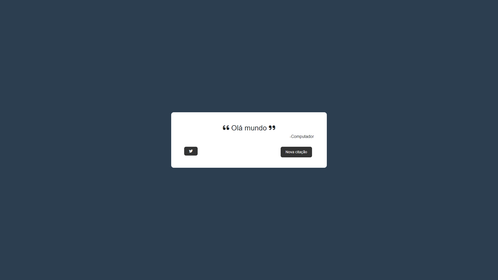

<h1 align="center">
   Random Quote Machine
</h1>

## 
 <u>Preview da página:</u> 

  

> A página se comporta como uma máquina que exibe citações "aleatórias"

<h4 align="center"><a href="https://tahaluh.github.io/random-quote-fcc/">Clique para visitar o projeto</a></h4>

---
# 💼 Tecnologias Utilizadas

As seguintes ferramentas foram usadas na construção do projeto:

- Html
- Css
- Javascript
- Jquery

*Também foram aplicados conceitos de html semântico, seo e responsividade*

### Ajustes e melhorias

O projeto ainda está em desenvolvimento e as próximas atualizações serão voltadas nas seguintes tarefas:

- [ ] Conexão com API
- [ ] Tarefa 4

---

Feito por Thauã Magalhães 👋🏽 Entre em contato!

 
